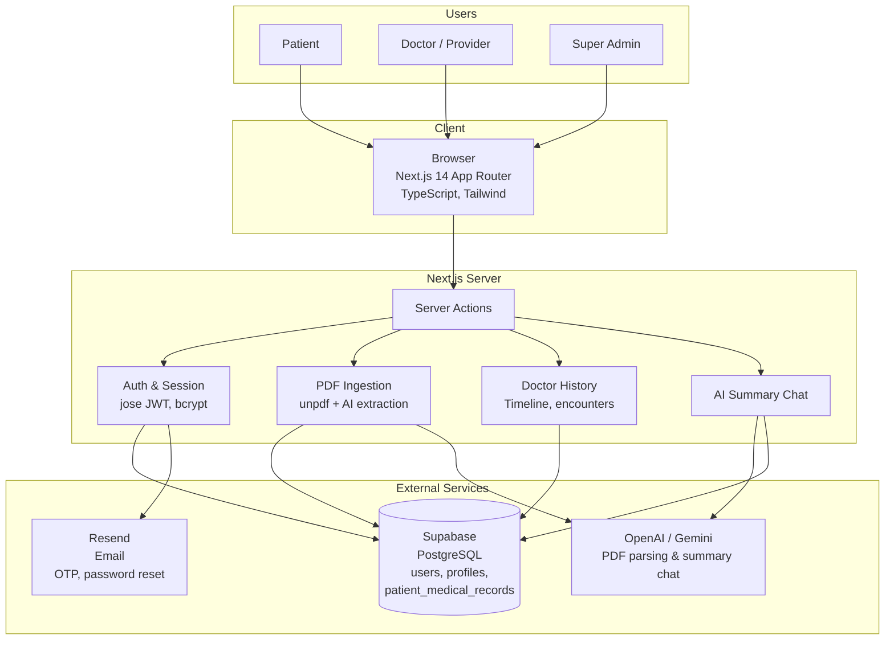

# MedLedger-AI

<div align="center">

**Intelligence-driven healthcare ecosystem** — Patient-controlled medical records, provider verification, AI-powered PDF parsing, and a doctor-friendly patient history timeline with an AI summary chatbot.

[](https://nextjs.org/)
[](https://www.typescriptlang.org/)
[](https://supabase.com/)
[](https://vercel.com)

</div>

---

## Table of Contents

- [Overview](#overview)
- [Features](#features)
- [Tech Stack](#tech-stack)
- [Architecture](#architecture)
- [Project Structure](#project-structure)
- [Database Schema](#database-schema)
- [Environment Variables](#environment-variables)
- [Setup](#setup)
- [Scripts](#scripts)
- [User Flows](#user-flows)
- [Deployment](#deployment)
- [Related Documentation](#related-documentation)
- [License](#license)

---

## Overview

**MedLedger-AI** is a full-stack healthcare web application that bridges patients, providers (doctors), and administrators in a unified, AI-assisted ecosystem. Patients can view their medical history in one place. Providers can create structured records, upload PDFs for AI-powered extraction, and access an interactive patient history timeline with an AI chatbot for quick summaries. Super admins approve provider sign-ups and monitor platform health.

### Key Highlights

- **Role-based access control** — Patient, Provider, Admin, and Superuser roles with route protection
- **Custom authentication** — JWT-based sessions (jose), bcrypt password hashing, OTP and password reset via Resend
- **AI-powered workflows** — OpenAI (gpt-4o-mini) or Google Gemini (gemini-2.0-flash) for PDF extraction and history summarization
- **FHIR-lite data model** — Structured medical records stored as JSONB for flexibility and interoperability

> **For resume/portfolio:** See [RESUME_PROJECT_DESCRIPTION.md](./RESUME_PROJECT_DESCRIPTION.md) for bullets, detailed technical explanation, and interview talking points.

---

## Features

### For Patients

| Feature | Description |
|---------|-------------|
| **Registration** | Email + password sign-up with OTP verification sent via Resend |
| **Login** | Email/password authentication; "Forgot password?" sends reset link to email |
| **Patient dashboard** | View profile and read-only medical history (records added by providers) |
| **Medical history** | Timeline of encounters, medications, conditions, and notes — no edit access |

### For Doctors (Providers)

| Feature | Description |
|---------|-------------|
| **Registration** | Sign up with email, password, optional NPI; email verification required |
| **Provider approval** | Account stays **pending** until a super admin verifies; no dashboard access until approved |
| **Create medical record** | Structured form: demographics, admission, clinical summary, medications, conditions, vitals, treatment plan |
| **Link or create patient** | Search existing patients by email or create a new patient profile |
| **Parse from PDF** | Upload a medical record PDF → unpdf extracts text → AI (OpenAI/Gemini) extracts structured fields → auto-fills form with validation and confidence score |
| **Patient history** | Select a patient → view **filterable timeline** (date range, event type, "only abnormal," search) → expand encounters → detail panel with labs, medications, conditions, notes, documents |
| **AI Summary chat** | Quick bullet-point summary of patient history; ask follow-up questions (e.g. "What are the current medications?") — uses full history as context |

### For Super Admins

| Feature | Description |
|---------|-------------|
| **Admin login** | First admin can self-create; subsequent admins via existing admin flow |
| **Dashboard** | View counts: total patients, providers, pending providers |
| **Verify / Reject providers** | Approve or reject pending provider sign-ups; manage provider list |

---

## Tech Stack

| Layer | Technology | Notes |
|-------|------------|-------|
| **Frontend** | Next.js 14 (App Router) | React Server Components, Server Actions |
| | TypeScript 5.6 | Strict mode |
| | Tailwind CSS 3.4 | Styling |
| **Backend** | Next.js Server Actions | Mutations, API logic |
| | Supabase (PostgreSQL) | Database, realtime (optional) |
| **Auth** | Session cookie (HTTP-only) | JWT signed with jose (HS256) |
| | bcryptjs | Password hashing |
| **Email** | Resend | OTP, password reset, verification emails |
| **AI** | Vercel AI SDK | `generateObject`, `streamText` |
| | OpenAI (gpt-4o-mini) | Primary for PDF extraction & chat |
| | Google Gemini (gemini-2.0-flash) | Fallback when OpenAI key not set |
| **PDF parsing** | unpdf | Text extraction from PDF |
| | Zod | Schema validation for AI output |
| **Deployment** | Vercel | GitHub-linked, auto-deploy on push |

### Key Dependencies

- `@supabase/supabase-js` — Supabase client
- `@ai-sdk/openai`, `@ai-sdk/google` — AI providers
- `ai` — Vercel AI SDK (generateObject, streamText)
- `resend` — Transactional email
- `jose` — JWT sign/verify
- `bcryptjs` — Password hashing
- `unpdf` — PDF text extraction
- `zod` — Schema validation

---

## Architecture



### Data Flow Summary

| Actor | Path |
|-------|------|
| **Patient** | Browser → Auth (login/register/OTP) → Resend for email; Dashboard → Server Actions → Supabase (read medical history) |
| **Doctor** | Browser → Auth → Resend; Dashboard → Create record (form or PDF → unpdf + AI → form) → Supabase; Patient history → Server Actions → Supabase (timeline) + AI (summary chat) |
| **Admin** | Browser → Auth → Dashboard → Server Actions → Supabase (verify/reject providers, stats) |

---

## Project Structure

```
medledger-ai/
├── app/
│   ├── api/
│   │   └── test-parse-pdf/     # API route for testing PDF parse
│   ├── auth/
│   │   ├── admin/              # Admin login, first-admin creation
│   │   ├── doctor/             # Doctor auth landing (login vs register)
│   │   ├── forgot-password/    # Request password reset
│   │   ├── login/
│   │   │   ├── patient/        # Patient login
│   │   │   └── doctor/         # Doctor login
│   │   ├── patient/            # Patient auth landing
│   │   ├── register/
│   │   │   ├── patient/        # Patient registration
│   │   │   └── provider/       # Provider registration
│   │   ├── reset-password/     # Set new password (from reset link)
│   │   └── verify-email/       # OTP verification
│   ├── dashboard/
│   │   ├── admin/              # Super admin: stats, verify providers
│   │   ├── doctor/             # Provider dashboard
│   │   │   ├── history/        # Patient history timeline + AI chat
│   │   │   └── records/new/    # Create medical record (form + PDF parse)
│   │   └── patient/            # Patient dashboard (view history)
│   ├── globals.css
│   ├── layout.tsx
│   └── page.tsx                # Landing page
├── lib/
│   ├── auth/
│   │   ├── otp.ts              # OTP generation, verification
│   │   ├── password.ts         # bcrypt hash/verify
│   │   └── session.ts          # JWT create/get/destroy
│   ├── doctor-history/
│   │   └── normalize.ts        # Records → encounters/timeline
│   ├── email/
│   │   ├── resend-config.ts    # Multi-sender Resend setup
│   │   ├── send-otp.ts         # OTP email
│   │   └── send-password-reset.ts
│   ├── pdf-ingestion/
│   │   ├── extractor.ts        # AI extraction (OpenAI/Gemini)
│   │   ├── map-to-prefill.ts   # Map extracted JSON → form payload
│   │   ├── parser.ts           # unpdf text extraction
│   │   └── schema.ts           # Zod schemas for AI output
│   ├── supabase/
│   │   └── server.ts           # Server Supabase client
│   ├── types/
│   │   ├── doctor-history.ts   # Encounter, TimelineEvent types
│   │   └── medical-record.ts   # RecordPayload (FHIR-lite)
│   └── db/
│       └── database.types.ts   # Generated DB types (optional)
├── supabase/
│   └── migrations/
│       ├── 001_initial_schema.sql      # users, auth_sessions, patient_profile, provider_profile
│       ├── 002_patient_medical_records.sql
│       ├── 003_super_admin_schema.sql  # admin_profile, RBAC, audit
│       ├── 004_record_source_file.sql  # source_file, extracted_at, confidence_score
│       ├── 005_wipe_all_users.sql      # Utility (dev)
│       └── RUN_ME_create_patient_medical_records.sql  # Standalone if table missing
├── scripts/
│   └── test-pdf-parse.ts       # CLI test for PDF extraction
├── .env.example
├── next.config.js
├── package.json
├── tailwind.config.ts
├── tsconfig.json
├── DEPLOY_VERCEL.md            # Vercel deployment guide
├── RESUME_PROJECT_DESCRIPTION.md
└── README.md
```

---

## Database Schema

### Core Tables

| Table | Description |
|-------|-------------|
| **users** | `id`, `email`, `phone_e164`, `password_hash`, `role` (patient/provider/admin/superuser), `status` (pending/active/disabled), `email_verified_at`, timestamps |
| **auth_sessions** | `user_id`, `refresh_token_hash`, `device_id`, `expires_at`, `revoked_at` |
| **patient_profile** | `user_id`, demographics (name, DOB, gender, contact, address, MRN) |
| **provider_profile** | `user_id`, NPI, specialty, facility, verification_status, etc. |
| **patient_medical_records** | `patient_user_id`, `provider_user_id`, `title`, `record_date`, `summary`, `fhir_lite_json` (JSONB), `source_file`, `extracted_at`, `confidence_score` |
| **admin_profile** | `user_id`, superuser flag, audit fields |

### Enums

- `user_role`: patient, provider, admin, superuser
- `user_status`: pending, active, disabled
- `verification_status`: unverified, pending, verified, rejected, suspended

### FHIR-lite JSON Structure (`fhir_lite_json`)

Stored per record; includes:

- **patient** — name, DOB, gender, contact, address
- **admission** — admission/discharge dates, chief complaint
- **clinicalSummary** — summary, presenting illness, HPI
- **medications** — name, dosage, route, frequency, status
- **medicalHistory** — conditions (with ICD), surgical history
- **vitals** — BP, HR, temp, SpO2, weight, height
- **treatmentPlan** — interventions, goals

---

## Environment Variables

Copy `.env.example` to `.env.local` and fill in values.

### Required

| Variable | Description |
|----------|-------------|
| `NEXT_PUBLIC_SUPABASE_URL` | Supabase project URL (from Project Settings → API) |
| `NEXT_PUBLIC_SUPABASE_ANON_KEY` | Supabase anon (public) key |
| `SUPABASE_SERVICE_ROLE_KEY` | Supabase service_role key (server-only, secret) |
| `RESEND_API_KEY` | Resend API key for email |
| `SESSION_SECRET` | Long random string for JWT signing (min 32 chars) |
| `NEXT_PUBLIC_APP_URL` | App base URL (e.g. `http://localhost:3000` or `https://your-app.vercel.app`) |

### Optional (AI features)

| Variable | Description |
|----------|-------------|
| `OPENAI_API_KEY` | OpenAI API key (used first if set) |
| `GEMINI_API_KEY` or `GOOGLE_GENERATIVE_AI_API_KEY` | Gemini API key (fallback if OpenAI not set) |

### Optional (email)

| Variable | Description |
|----------|-------------|
| `RESEND_FROM_EMAIL` | From address (e.g. `MedLedger <onboarding@resend.dev>`) |
| `RESEND_DEV_OVERRIDE_TO` | Redirect all dev emails to this address |

### Optional (Azure OpenAI)

| Variable | Description |
|----------|-------------|
| `AZURE_OPENAI_API_KEY` | Azure OpenAI key |
| `AZURE_OPENAI_RESOURCE_NAME` | Azure resource name |
| `AZURE_OPENAI_DEPLOYMENT_NAME` | Deployment name |

See `.env.example` for the full list, including multi-sender Resend config.

---

## Setup

### 1. Clone and install

```bash
git clone https://github.com/yashdayma55/medledger-ai.git
cd medledger-ai
npm install
```

### 2. Supabase

1. Create a project at [supabase.com](https://supabase.com)
2. In **SQL Editor**, run migrations in order:
   - `supabase/migrations/001_initial_schema.sql`
   - `supabase/migrations/002_patient_medical_records.sql`
   - `supabase/migrations/003_super_admin_schema.sql`
   - `supabase/migrations/004_record_source_file.sql`
3. If `patient_medical_records` is missing, run `RUN_ME_create_patient_medical_records.sql`
4. Copy from **Project Settings → API**: URL, anon key, service_role key

### 3. Resend

1. Sign up at [resend.com](https://resend.com) and create an API key
2. Set `RESEND_API_KEY`; optionally `RESEND_FROM_EMAIL`
3. For local testing: set `RESEND_DEV_OVERRIDE_TO` to your email

### 4. AI (OpenAI or Gemini)

- **OpenAI:** [platform.openai.com](https://platform.openai.com) → API key → `OPENAI_API_KEY`
- **Gemini:** [aistudio.google.com](https://aistudio.google.com/app/apikey) → `GEMINI_API_KEY`

The app uses OpenAI if `OPENAI_API_KEY` is set; otherwise falls back to Gemini.

### 5. Environment

```bash
cp .env.example .env.local
```

Edit `.env.local` and set all required variables.

### 6. Run

```bash
npm run dev
```

Open [http://localhost:3000](http://localhost:3000).

---

## Scripts

| Command | Description |
|---------|-------------|
| `npm run dev` | Start development server |
| `npm run build` | Production build |
| `npm run start` | Start production server |
| `npm run lint` | Run ESLint |
| `npm run test:pdf` | Test PDF extraction (CLI script) |
| `npm run test:pdf:text` | Test PDF extraction (text-only, no AI) |

---

## User Flows

### Patient

1. **Register** → Enter email + password → Receive OTP email → Verify → Sign in
2. **Login** → Email + password; "Forgot password?" → Email reset link → Set new password
3. **Dashboard** → View profile and medical history (read-only)

### Doctor

1. **Register** → Email, password, optional NPI → Verify email → Account **pending**
2. **Login** → After admin approval, access provider dashboard
3. **Create record** → Select patient (by email) or create new → Fill form **or** upload PDF → Click "Parse PDF" → AI fills form → Edit if needed → Save
4. **Patient history** → Select patient → Apply filters (date, event type, abnormal only, search) → Expand encounters → Select for detail panel → Open **AI Summary chat** for summaries or questions

### Super Admin

1. **Login** → First admin self-creates; others use admin login
2. **Dashboard** → View patient/provider/pending counts → **Verify** or **Reject** pending providers

---

## Deployment

### Vercel (recommended)

1. Go to [vercel.com/new](https://vercel.com/new)
2. Import repository `yashdayma55/medledger-ai` from GitHub
3. Add environment variables (Supabase, Resend, `SESSION_SECRET`, `NEXT_PUBLIC_APP_URL`, optionally `OPENAI_API_KEY` / `GEMINI_API_KEY`)
4. Deploy; after first deploy, set `NEXT_PUBLIC_APP_URL` to your Vercel URL

**Full guide:** [DEPLOY_VERCEL.md](./DEPLOY_VERCEL.md)

### Notes

- Apply Supabase migrations to production database
- Use a strong `SESSION_SECRET` (e.g. `openssl rand -base64 32`)
- Never commit `.env.local` or real API keys

---

## Related Documentation

| Document | Description |
|----------|-------------|
| [DEPLOY_VERCEL.md](./DEPLOY_VERCEL.md) | Step-by-step Vercel deployment, env checklist, troubleshooting |
| [RESUME_PROJECT_DESCRIPTION.md](./RESUME_PROJECT_DESCRIPTION.md) | One-liner, resume bullets, detailed technical write-up, interview talking points |

---

## License

Private / as per your repository settings.
